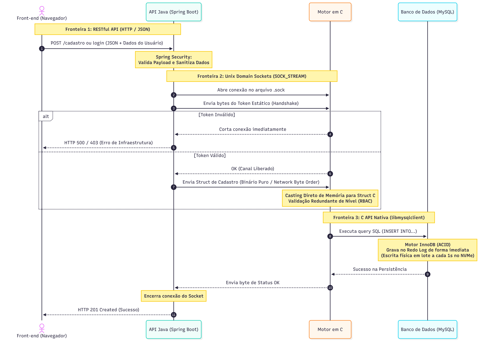

# core-auth-ipc

## Visão Geral do Projeto

Sistema poliglota de autenticação e controle de acesso baseado em IPC (Inter-Process Communication), integrando um motor nativo em C, uma API em Java (Spring Boot) e o banco de dados MySQL. O projeto foi arquitetado sob os pilares de escalabilidade, eficiência e segurança defensiva.

O sistema será implantado e testado em um ambiente de infraestrutura própria (*Home Lab*) dedicado, operando sobre o sistema operacional Ubuntu Server. O hardware hospedeiro possui as seguintes especificações:
* **Processador:** Intel Core i3-2100  
* **Memória RAM:** 8GB DDR3  
* **Armazenamento:** SSD NVMe 128GB  

A aplicação rodará localmente nessa máquina, servindo como laboratório real para testes rigorosos de estresse, desempenho, segurança e comportamento de infraestrutura.

O objetivo principal de engenharia deste projeto é garantir robustez de software, sob a premissa de que **o hardware deve falhar antes do código**. A aplicação será levada ao limite dos componentes físicos do servidor para garantir que atenda aos princípios impostos no planejamento.

Todos os relatórios estarão disponíveis para consulta e validação geral de engenharia.

---

## Sobre a Stack Tecnológica

### C
A linguagem C foi escolhida para construir o motor que gerencia a comunicação do sistema. Como um dos pilares do projeto é a eficiência, o C se encaixa perfeitamente por ser uma linguagem de baixo nível que dá acesso direto à memória e ao hardware. Isso nos permite extrair o máximo de desempenho no gerenciamento de processos e no controle de dados. Levando em conta que o hardware do nosso laboratório possui recursos limitados (Core i3 de 2ª geração e memória DDR3), evitar o desperdício de recursos se torna um ponto estratégico.

### Java
Java entra para garantir o segundo pilar do projeto: a robustez. A API construída com Spring Boot funcionará como a porta de entrada da aplicação, cuidando do recebimento das requisições e garantindo que o tráfego de rede seja tratado de forma organizada e segura. Embora seja uma linguagem conhecida por ter uma sintaxe mais longa, a sua estabilidade e maturidade são ideais para criar uma barreira de segurança eficiente, evitando falhas comuns e garantindo que o sistema continue de pé mesmo sob forte estresse.

### MySQL
Para fechar o último pilar, escolhi o MySQL para cuidar da persistência dos dados. Ele é um banco de dados relacional rápido, amplamente utilizado no mercado e altamente escalável. O MySQL oferece camadas sólidas de segurança e consistência, garantindo que as informações de autenticação sejam gravadas e consultadas de forma ágil e segura, aproveitando bem a velocidade de leitura e escrita do SSD NVMe do servidor.

## Fluxo de dados e comunicação IPC

Para entender como a aplicação se comporta desde a requisição do usuário até a persistência no banco de dados, o fluxo segue as seguintes etapas:

1. **Entrada e Validação:** O Front-end envia os dados de cadastro ou login via HTTP (JSON) para a API Java (Spring Boot), onde o Spring Security faz a primeira camada de validação e limpeza dos dados.
2. **Comunicação entre Processos (IPC):** A API Java abre uma conexão local via *Unix Domain Sockets* para conversar direto com o Motor em C. Após uma validação de segurança (Handshake), os dados são transmitidos em formato binário direto para a memória do processo em C.
3. **Processamento Nativo e Persistência:** O Motor em C recebe a estrutura de dados, aplica uma validação redundante de permissões e utiliza a API nativa do MySQL (`libmysqlclient`) para executar a gravação no banco de dados, aproveitando a eficiência do hardware e do SSD.
4. **Retorno:** Assim que o banco confirma a gravação, o Motor em C sinaliza a API Java, que encerra o socket de comunicação e devolve uma resposta de sucesso (HTTP 201) para o usuário.

## Considerações sobre o Projeto

À primeira vista, o projeto pode parecer pretensioso ou até "exagerado" por conta da complexidade da sua arquitetura. No entanto, mais do que criar um sistema de autenticação, o verdadeiro objetivo aqui é o desafio técnico. 

Unir duas linguagens com filosofias tão distantes quanto C e Java, e fazê-las funcionar de maneira eficiente e robusta em um hardware limitado (operando no limite de um Core i3 antigo), é o que me motiva a fazer esse sistema dar certo. Pensar em cada detalhe, explorar o comportamento do sistema operacional, configurar o ambiente de infraestrutura e comparar diferentes padrões de arquitetura torna o desenvolvimento desse projeto algo grandioso para o meu aprendizado.

O conhecimento prático e a experiência de engenharia adquiridos durante toda essa jornada são o que realmente fará a diferença na minha formação. Escolhi um projeto complexo justamente porque sei que o esforço necessário para superar esses gargalos físicos e de software me trará um crescimento enorme. Será uma grande satisfação construir cada etapa dessa aplicação e, ao final, ver toda essa engrenagem rodando em harmonia.